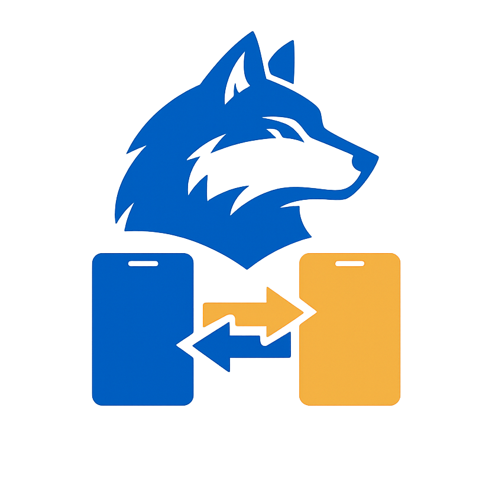

# 🌐 Dialca Link

> **A local Android-to-Android communication bridge that turns a secondary phone with a SIM card into a telephony gateway for your primary device.**

<p align="center">
  
</p>


---

# 🇺🇸 English

## Overview

Dialca Link is an Android application designed to bridge two Android devices over a **local network**, allowing one device (**Gateway**) to relay SMS messages and phone call events to another (**Client**) in real time.

The project was born from a real-world problem:

> Having a flagship phone without a working SIM while keeping the SIM card in an older Android device.

Instead of constantly checking the secondary phone, Dialca Link synchronizes incoming events so the main device becomes the central interaction point.

The entire communication is performed **locally**, requiring **no cloud services, no Firebase, and no external servers.**

---

## Problem Statement

Many users own:

- 📱 A primary Android phone without cellular connectivity.
- 📱 A secondary Android phone containing the SIM card.

Incoming calls and SMS messages arrive only on the secondary phone, forcing users to monitor two different devices.

Dialca Link solves this problem by transforming the secondary device into a **Telephony Gateway**, forwarding events to the primary device over the local network.

---

# Architecture

```
                WiFi Hotspot
        ┌──────────────────────────┐

        Gateway (Android + SIM)
                │
                │
        Local WebSocket Server
                │
                │
        ───────────────────────────
                │
                │
      Client (Primary Android)
```

---

## Device Roles

### Gateway

Responsible for:

- Receiving SMS
- Detecting phone calls
- Resolving contact names
- Persisting local data
- Hosting the WebSocket server
- Synchronizing events

---

### Client

Responsible for:

- User Interface
- Notifications
- Local database
- Receiving synchronized events
- Displaying history

---

# Features

## Current

- Device pairing
- Local WebSocket communication
- Real-time SMS notifications
- Real-time phone call notifications
- Local synchronization
- Persistent history
- Contact name resolution
- Offline-first architecture
- Zero cloud dependency

---

## Planned

- Remote SMS sending
- SMS replies
- Call rejection
- Remote call management
- Multiple client support
- Remote synchronization over Internet

---

# Technology Stack

## Mobile

- Flutter
- Dart

## State Management

- Riverpod

## Local Database

- Drift ORM
- SQLite

## Networking

- WebSocket

## Android Native

- Foreground Service
- Broadcast Receivers
- PhoneStateListener
- Method Channels

---

# Project Structure

```
lib/

core/
shared/

app/

features/
│
├── sms/
├── calls/
├── pairing/
├── sync/
└── notifications/
...
```

---

# Communication Flow

```
Incoming SMS

↓

BroadcastReceiver

↓

Gateway Service

↓

SQLite

↓

WebSocket

↓

Client

↓

SQLite

↓

Notification
```

---

# Design Principles

- Offline First
- Local First
- Event Driven
- Client-Server Architecture
- Single Source of Truth
- Modular Design
- Feature-First Organization

---

# Why Local Instead of Cloud?

Unlike many synchronization apps, Dialca Link intentionally avoids cloud infrastructure.

Benefits:

- No servers
- No monthly costs
- No user accounts
- Lower latency
- Better privacy
- Full local ownership

---

# Screenshots

```
Coming Soon
```

---

# Installation

```bash
git clone https://github.com/<your_username>/dialcalink.git
```

Install dependencies

```bash
flutter pub get
```

Run

```bash
flutter run
```

---

# Permissions

Gateway

- RECEIVE_SMS
- READ_SMS
- READ_CONTACTS
- READ_PHONE_STATE
- FOREGROUND_SERVICE
- RECEIVE_BOOT_COMPLETED
- POST_NOTIFICATIONS
- INTERNET
- ACCESS_WIFI_STATE

Client

- POST_NOTIFICATIONS
- INTERNET
- ACCESS_WIFI_STATE

---

# Roadmap

## Version 1.0

- Gateway mode
- Client mode
- SMS synchronization
- Call synchronization
- Local history
- Device pairing

---

## Version 1.1

- Remote SMS

---

## Version 1.2

- SMS replies

---

## Version 1.3

- Call management

---

## Version 2.0

- Internet synchronization
- Multiple clients
- Cross-network communication

---

# Contributing

Contributions, issues and feature requests are welcome.

Feel free to fork the repository and submit a Pull Request.

---

# License

This project is licensed under the MIT License.

---

# 🇪🇸 Español

## Descripción

Dialca Link es una aplicación Android desarrollada para conectar dos dispositivos Android mediante una **red local**, permitiendo que uno de ellos (**Gateway**) retransmita mensajes SMS y eventos de llamadas hacia otro dispositivo (**Cliente**) en tiempo real.

El proyecto nació para resolver un problema real:

> Tener un teléfono principal sin acceso a una SIM mientras otro dispositivo Android mantiene la tarjeta SIM instalada.

En lugar de revisar constantemente el teléfono secundario, Dialca Link sincroniza los eventos entrantes para convertir el dispositivo principal en el centro de interacción.

Toda la comunicación ocurre **localmente**, sin utilizar **Firebase, servidores externos ni servicios en la nube.**

---

## Problema

Muchos usuarios poseen:

- 📱 Un teléfono principal sin conectividad celular.
- 📱 Un teléfono secundario donde se encuentra la SIM.

Las llamadas y mensajes llegan únicamente al dispositivo secundario, obligando al usuario a monitorear ambos teléfonos.

Dialca Link convierte ese segundo dispositivo en un **Gateway Telefónico**, sincronizando los eventos hacia el teléfono principal.

---

# Arquitectura

```
             Hotspot WiFi
      ┌──────────────────────────┐

      Gateway (Android + SIM)
              │
              │
      Servidor WebSocket
              │
              │
      ───────────────────────────
              │
              │
      Cliente (Android Principal)
```

---

## Roles

### Gateway

Responsable de:

- Detectar SMS
- Detectar llamadas
- Resolver contactos
- Persistir la información
- Hospedar el servidor WebSocket
- Sincronizar eventos

---

### Cliente

Responsable de:

- Interfaz de usuario
- Notificaciones
- Base de datos local
- Recepción de eventos
- Historial

---

# Características

## Actuales

- Vinculación entre dispositivos
- Comunicación WebSocket
- Notificaciones en tiempo real
- Sincronización local
- Historial persistente
- Resolución automática de contactos
- Arquitectura Offline First
- Sin dependencia de Internet

---

## Futuras

- Envío remoto de SMS
- Respuesta de SMS
- Gestión remota de llamadas
- Soporte para múltiples clientes
- Sincronización por Internet

---

# Stack Tecnológico

- Flutter
- Dart
- Riverpod
- Drift ORM
- SQLite
- WebSocket
- Android Foreground Services
- Broadcast Receivers
- PhoneStateListener

---

# Filosofía

- Offline First
- Local First
- Arquitectura Cliente-Servidor
- Modular
- Escalable
- Basada en eventos

---

# ¿Por qué comunicación local?

Dialca Link evita deliberadamente el uso de infraestructura cloud.

Ventajas:

- Sin servidores
- Sin costos mensuales
- Sin cuentas de usuario
- Mayor privacidad
- Menor latencia
- Control total de los datos

---

# Instalación

```bash
git clone https://github.com/<tu_usuario>/dialcalink.git
```

```bash
flutter pub get
```

```bash
flutter run
```

---

# Roadmap

## v1.0

- Gateway
- Cliente
- Sincronización de SMS
- Sincronización de llamadas
- Historial

## v1.1

- Envío remoto de SMS

## v1.2

- Respuesta de SMS

## v1.3

- Gestión remota de llamadas

## v2.0

- Comunicación por Internet
- Múltiples clientes

---

# Licencia

Este proyecto está distribuido bajo la licencia MIT.

---

<p align="center">

Made with ❤️ by **Dialcadev**

Part of the **Dialca Ecosystem**

</p>